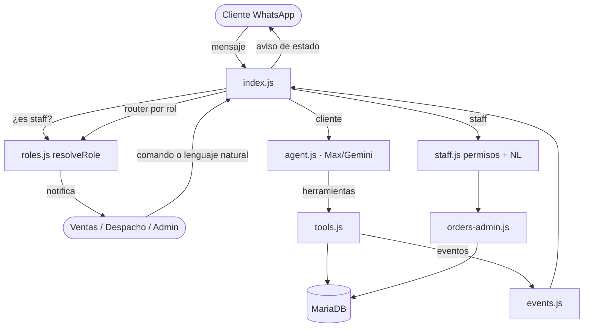

# 🤖 Mascotiendas WhatsApp Bot — "Max"

Bot oficial de WhatsApp para **Mascotiendas La Serena/Coquimbo**. Atiende a los clientes 24/7 con tono local chileno bajo la identidad de **Max**, un vendedor humano; busca productos y stock, toma y agenda pedidos en la base de datos, deriva casos a un ejecutivo, y coordina la operación entre los roles de **ventas, despacho y administración**, cada uno desde su propio WhatsApp.

Construido sobre **Node.js** con `whatsapp-web.js` (Puppeteer / Chrome headless) y **Gemini** (`gemini-2.5-flash`) como motor de razonamiento, conectado a **MariaDB** (WAMP, puerto `3308`).

---

## 🗺️ Arquitectura y flujo



Cada mensaje entrante se **serializa por chat** (evita carreras sobre el historial). Si el remitente es un número de staff, entra en *modo gestión*; si no, lo atiende el agente de ventas Max.

---

## 📂 Componentes

| Archivo | Rol |
|---------|-----|
| [index.js](index.js) | Orquestador: cliente WhatsApp, filtros, ruteo cliente/staff, notificaciones, salud y scheduler. |
| [agent.js](agent.js) | Agente Gemini "Max": prompt de personalidad, agent loop, transcripción de audio y `sanitizeAnswer` (red determinista). |
| [tools.js](tools.js) | Herramientas del agente: búsqueda de productos, detalle, zonas de despacho, historial, y **createOrder con validación de precio/stock server-side**. |
| [orders-admin.js](orders-admin.js) | Gestión de estados de pedido, listado de accionables, resumen de pedido y mensaje al cliente. |
| [roles.js](roles.js) | Números por rol, `resolveRole` y **router de notificaciones** por evento (con fallback a admin). |
| [staff.js](staff.js) | Permisos por rol e interpretación de lenguaje natural de staff (parser de intención + confirmación). |
| [reports.js](reports.js) | Resumen diario de ventas (clientes nuevos/recurrentes, incompletos, top productos…). |
| [config-store.js](config-store.js) | `getConfig`/`setConfig` (upsert) sobre la tabla `configuraciones`. |
| [history-store.js](history-store.js) | Persistencia del historial de conversación en la tabla `bot_historial` (sobrevive reinicios). |
| [db.js](db.js) | Pool de conexiones MariaDB (`mysql2/promise`). |
| [events.js](events.js) | `EventEmitter` compartido (orderCreated / orderUpdated / orderCancelled). |

---

## 🧠 El agente "Max" (cara al cliente)

Reglas clave del `SYSTEM_PROMPT` ([agent.js](agent.js)):

- **Identidad:** se llama **Max**, vendedor humano de Mascotiendas; jamás admite ser IA. "Max" es solo su nombre, nunca se lo dice al cliente.
- **Tono:** chileno cálido y respetuoso (sin groserías), brevedad máxima (~1 oración), mínimos turnos para cerrar.
- **Empatía:** baja la energía comercial si la mascota está enferma y **deriva al veterinario** (no diagnostica). Prioriza el bienestar del animal sobre la venta.
- **Sin relleno:** ejecuta herramientas en silencio (nada de "déjame revisar"), sin disculpas ni exponer el proceso interno.
- **Precisión:** nunca inventa precios/stock; precios siempre con `$`.

**Red determinista (`sanitizeAnswer`)** complementa al prompt: elimina "Max" usado como vocativo al cliente, fugas de proceso ("en mi sistema") y normaliza precios. Doble salvaguarda evita respuestas vacías.

### Validación de pedidos (createOrder)
`createOrder` **no confía en los montos del modelo**: recalcula cada precio desde la BD, rechaza productos inactivos/sin stock, revalida el costo de delivery contra la zona, acota el descuento y recomputa el total de forma autoritativa.

---

## 👥 Flujo de trabajo multi-rol

Equipo separado (ventas / despacho / admin), pago **mixto** (transferencia o efectivo), cada rol con su propio WhatsApp.

### Ciclo de vida del pedido

| Estado | Lo dispara | Notifica a |
|--------|-----------|-----------|
| `pendiente` | Max / web (al crear) | 🔔 Ventas |
| `pagado` | **Ventas** confirma transferencia | 🔔 Despacho (listo para despachar) |
| `preparando` | **Despacho** | — |
| `enviado` | **Despacho** | 📲 Cliente ("va en camino") |
| `entregado` | **Despacho** (cobra efectivo/tarjeta) | 📲 Cliente ("entregado") |
| `cancelado` | Cliente (vía Max) o staff | 🔔 Ventas + Despacho · 📲 Cliente |

> Pago mixto: la transferencia pasa por `pagado` (verificación previa de Ventas); el efectivo se salta `pagado` y se cobra al `entregar`.

### Permisos por rol ([staff.js](staff.js))

| Rol | Estados que puede fijar | Comandos |
|-----|------------------------|----------|
| **admin** | todos | todos |
| **ventas** | `pagado`, `cancelado` | `!resumen`, `!pendientes`, `!estado`, `!ayuda` |
| **despacho** | `preparando`, `enviado`, `entregado` | `!pendientes`, `!estado`, `!ayuda` |

### Comandos de staff
Desde el WhatsApp de cada rol:

- `!estado <id> <nuevo>` — avanza el estado (ej: `!estado 67 enviado`).
- `!pendientes` — pedidos por gestionar (marca los "sin agendar").
- `!resumen` / `!reporte` — resumen de ventas del día (admin/ventas).
- `!roles` / `!setrol <rol> <numero>` — ver/configurar números por rol (admin).
- `!ayuda` — comandos disponibles según el rol.

### Lenguaje natural (con confirmación)
El staff también puede escribir natural y Max interpreta y **confirma antes de aplicar**:

```
Despacho → Max:  salí con el 67
Max → Despacho:  ¿Marco el pedido #67 como enviado? Responde sí.
Despacho → Max:  sí
Max → Despacho:  ✅ Pedido #67 → enviado. 📲 Cliente notificado.
Max → Cliente:   🚚 Tu pedido #67 ya va en camino. ¡Llega pronto! 🐾
```

Entiende frases como *"ya entregué el pedido 5"*, *"el cliente pagó la transferencia del 88"*, *"qué pedidos tengo pendientes"*. Las confirmaciones pendientes expiran a los 5 minutos.

---

## 🔔 Router de notificaciones ([roles.js](roles.js))

`recipientsForEvent(evento)` enruta cada evento al rol correspondiente, con **fallback a admin** si el rol no está configurado (no se pierde ningún aviso):

| Evento | Destino |
|--------|---------|
| `order_created`, `order_handoff` | ventas |
| `order_updated`, `order_ready_for_dispatch` | despacho |
| `order_cancelled` | ventas + despacho |
| `daily_report`, `bot_health` | admin |

**Aviso al cliente:** antes de enviar, se verifica con `client.getNumberId` que el número esté en WhatsApp (los pedidos web pueden no estarlo); si no, no falla y se informa al staff.

---

## 📊 Resumen diario y 🩺 salud del bot

- **Resumen diario** ([reports.js](reports.js)): se envía al admin a la hora configurada (`admin_daily_report_time`, default 21:00 Chile) con ventas, ticket promedio, clientes nuevos vs recurrentes, pedidos incompletos, anulaciones, carritos abandonados y top productos. Persistencia anti-duplicado tras reinicios. Bajo demanda con `!resumen`.
- **Salud / uptime**: latido (`bot_last_heartbeat`) cada minuto; al reconectar, si detecta una caída > 5 min, **avisa al admin** ("estuve caído ~X min"). Reconexión automática con backoff y registro de estado en BD.

---

## ⚙️ Filtros de mensajes (anti-spam / anti-loop)

En [index.js](index.js):
1. **Antigüedad / offline**: ignora mensajes > 10 min o anteriores al encendido (`startupTime`).
2. **Grupos / difusión**: solo chats individuales.
3. **Contactos guardados**: si `bot_only_respond_to_unknown = '1'`, ignora la agenda (excepto staff).
4. **Vacíos**: ignora notificaciones de sistema sin texto (salvo notas de voz, que se transcriben).
5. **Anti-bucle**: > 6 respuestas/min al mismo chat → pausa 15 min.
6. **Handoff**: chats derivados a humano quedan en silencio `bot_handoff_pause_hours` (default 3h).
7. **Purga de memoria**: el estado en memoria de chats inactivos se descarta tras 6h.

> **Historial persistente:** la conversación de cada chat se guarda en la tabla `bot_historial`, así que **sobrevive a los reinicios** del bot (al recibir un mensaje, si no está en memoria se carga de la BD). Se borra con `!reiniciar` y se purgan filas sin actividad en 30 días. Para no leer config en cada mensaje, los números por rol se cachean en memoria 60s (se invalidan al usar `!setrol`).

---

## 🗄️ Configuración (tabla `configuraciones`, clave/valor)

| Clave | Descripción |
|-------|-------------|
| `admin_whatsapp_number` | Número del administrador (fallback de todos los avisos). |
| `ventas_whatsapp_number` | Número del encargado de ventas. |
| `despacho_whatsapp_number` | Número del encargado de despacho. |
| `bot_whatsapp_number` | Número del bot (para mensajes de error). |
| `bot_only_respond_to_unknown` | `'1'`/`'0'`: responder solo a no-contactos. |
| `bot_handoff_pause_hours` | Horas de silencio tras una derivación (default 3). |
| `admin_daily_report_time` | Hora `HH:MM` del resumen diario (default `21:00`). |
| `admin_daily_report_last` | (interno) última fecha enviada, anti-duplicado. |
| `bot_status`, `bot_last_heartbeat`, `bot_offline_since`, `bot_auth_failure_at` | (internos) telemetría de salud. |

Configurar los roles desde WhatsApp (admin): `!setrol ventas 569XXXXXXXX` · `!setrol despacho 569YYYYYYYY`.

---

## 🔧 Puesta en marcha (primera vez)

### Requisitos
- **Node.js 18+**.
- **WAMP con MariaDB** activo en el puerto `3308`, con la base `mascotiendas` importada.
- **Google Chrome** instalado en la ruta del sistema (ver `executablePath` en [index.js](index.js); por defecto `C:\Program Files\Google\Chrome\Application\chrome.exe`).
- Un **número de WhatsApp dedicado** para el bot (en un teléfono aparte).

### Pasos
1. **Instalar dependencias** (dentro de `agent/`):
   ```bash
   npm install
   ```
2. **Crear el archivo `.env`** en `agent/` con tus credenciales:
   ```env
   GEMINI_API_KEY=tu_api_key_de_gemini
   DB_HOST=127.0.0.1
   DB_PORT=3308
   DB_USER=root
   DB_PASS=
   DB_NAME=mascotiendas
   ```
3. **Verificar que MariaDB esté arriba** (WAMP en verde) — sin BD el bot no parte.
4. **Primer arranque** en consola:
   ```bash
   node index.js
   ```
   Aparecerá un **código QR** en la terminal. Escanéalo desde el WhatsApp del bot: *Ajustes → Dispositivos vinculados → Vincular un dispositivo*. La sesión queda guardada en `.wwebjs_auth/`, así que **los siguientes arranques no piden QR**.
5. Esperar el mensaje `✅ ¡Mascotiendas Bot está conectado y listo...`.
6. **Configurar los números de rol** desde el WhatsApp del administrador:
   ```
   !setrol ventas 569XXXXXXXX
   !setrol despacho 569YYYYYYYY
   ```
   (El número del admin se toma de la clave `admin_whatsapp_number`; mientras ventas/despacho no estén configurados, todos los avisos caen al admin.)

> La tabla `bot_historial` se crea sola al arrancar. Las demás tablas (`pedidos`, `configuraciones`, etc.) son del sitio web y deben existir previamente.

---

## 🚀 Operación

### Iniciar (consola, ver output en vivo)
```bash
node index.js
```

### Iniciar en segundo plano persistente (producción)
Para que no se apague al interactuar con herramientas de desarrollo:
```powershell
Invoke-CimMethod -ClassName Win32_Process -MethodName Create -Arguments @{ CommandLine = 'cmd.exe /c ""C:\nvm4w\nodejs\node.exe" index.js > chatbot.log 2>&1"'; CurrentDirectory = 'C:\wamp64\www\mascotiendas\agent' }
```

### Monitorear / detener
```powershell
Get-Content -Path "chatbot.log" -Wait -Tail 20      # logs en vivo
Get-Process node | Select-Object Id, StartTime       # estado
Stop-Process -Name node -Force                       # detener
```

---

## 🧪 Pruebas

Suite de regresión (en [tests/](tests)):

```bash
npm test            # stress-test conversacional del agente (usa Gemini)
npm run test:unit   # sanitizer + formato de precio
npm run test:report # resumen diario
npm run test:health # salud / uptime y config-store
npm run test:roles  # roles y router de notificaciones
npm run test:staff  # permisos + parser NL + flujo de gestión
npm run test:orders # gestión de estados + mensaje al cliente
npm run test:history # persistencia del historial de conversación
```

Salvo `npm test` (que llama a Gemini), las demás corren contra la BD local en segundos.

---

## ⚠️ Errores comunes

### 1. Perfil de sesión bloqueado (`.wwebjs_auth`)
Procesos Chrome huérfanos dejan el perfil bloqueado y el bot se cuelga. Cerrarlos:
```powershell
Get-CimInstance Win32_Process -Filter "Name = 'chrome.exe'" | Where-Object { $_.CommandLine -like "*user-data-dir=C:\wamp64*" } | ForEach-Object { Stop-Process -Id $_.ProcessId -Force }
```

### 2. Mensajes en "limbo" tras reinicios
Un mensaje enviado mientras el bot estaba apagado **no** gatilla los eventos al encender. El cliente debe enviar un **mensaje nuevo** una vez que aparezca `✅ ¡Mascotiendas Bot está conectado...`. (El *contexto* de la conversación sí se conserva: el historial se guarda en `bot_historial` y se recupera al volver.)

### 3. IDs `@lid`
Algunos clientes envían bajo el JID interno `@lid` en vez de `@c.us`. [index.js](index.js) resuelve el número real evaluando `getAlternateUserWid` dentro del navegador.

### 4. Números de staff no son clientes
Un número configurado como ventas/despacho/admin entra en *modo gestión*: **no** recibe atención de ventas. Para probar el agente de ventas, usar un número distinto.

### 5. El bot no responde a un staff por lenguaje natural
Si Max no entendió, responde pidiendo aclaración. Usar el comando exacto `!estado <id> <estado>` como vía segura, o `!ayuda`.

---

## 🗃️ Campos clave de `pedidos`

- `telefono`: formato internacional (`+56920571475`).
- `estado`: `pendiente · pagado · preparando · enviado · entregado · cancelado`.
- `fecha_despacho` / `hora_despacho`: agendamiento del despacho.
- `notas`: indicaciones para el repartidor.
- `metodo_entrega`: `delivery` / `retiro`.
